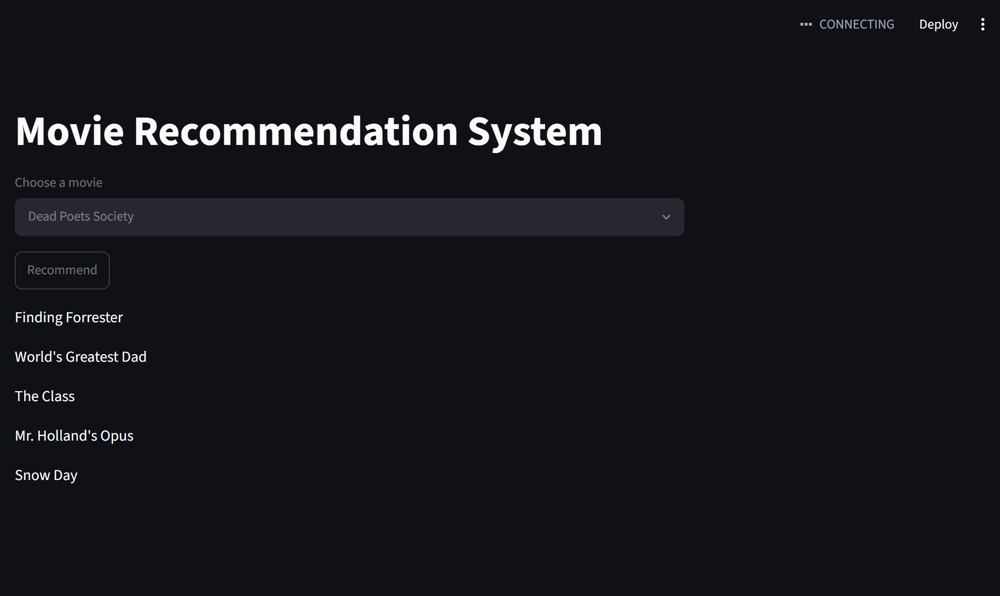

# 🎬 Movie Recommendation System

A content-based Movie Recommendation System built using **Python**, **Scikit-learn**, **NLTK**, and **Streamlit**. The application recommends similar movies based on genres, cast, crew, keywords, and movie overviews using Natural Language Processing (NLP) and Cosine Similarity.

---

## 🚀 Features

- 🎥 Recommend similar movies instantly
- 🔍 Search from thousands of movies
- 🧠 Content-based recommendation algorithm
- 📊 NLP-based feature engineering
- 🌐 Interactive Streamlit web interface

---

## 🛠️ Tech Stack

- Python
- Pandas
- NumPy
- Scikit-learn
- NLTK
- Streamlit
- Pickle

---

## 📂 Project Structure

```
Movie-Recommendation-System/
│
├── data/
│   ├── tmdb_5000_movies.csv
│   └── tmdb_5000_credits.csv
│
├── app.py
├── model.py
├── requirements.txt
├── README.md
└── .gitignore
```

---

## ⚙️ How It Works

1. Load the TMDB Movies and Credits datasets.
2. Merge both datasets.
3. Clean and preprocess the data.
4. Extract important movie features:
   - Genres
   - Keywords
   - Cast
   - Director
   - Overview
5. Apply stemming using NLTK.
6. Convert text into vectors using CountVectorizer.
7. Calculate movie similarity using Cosine Similarity.
8. Generate recommendation files.
9. Display recommendations through a Streamlit web application.

---

## 📦 Installation

### Clone the repository

```bash
git clone https://github.com/MoonRaker07/movie-recommendation-system.git

cd movie-recommendation-system
```

### Create a virtual environment (Optional)

```bash
python -m venv .venv
```

Windows

```bash
.venv\Scripts\activate
```

Linux / macOS

```bash
source .venv/bin/activate
```

### Install dependencies

```bash
pip install -r requirements.txt
```

---

## ▶️ Generate Required Model Files

The repository does **not** include the generated `.pkl` files because they exceed GitHub's file size limit.

Generate them locally by running:

```bash
python model.py
```

This will create:

- `movies.pkl`
- `similarity.pkl`

---

## ▶️ Run the Application

```bash
streamlit run app.py
```

---

## 🧠 Machine Learning Concepts Used

- Natural Language Processing (NLP)
- Feature Engineering
- CountVectorizer
- Cosine Similarity
- Content-Based Recommendation System

---

## 📸 Screenshots

### Recommendation Output



---

## 🚀 Future Improvements

- Display movie posters using the TMDB API
- Add IMDb ratings
- Implement collaborative filtering
- Hybrid recommendation engine
- Deploy on Streamlit Community Cloud

---

## 📚 Dataset

- TMDB 5000 Movies Dataset
- TMDB 5000 Credits Dataset

---

## 👨‍💻 Author

**Dhairya Sharma**

B.Tech in Artificial Intelligence & Machine Learning  
Kurukshetra University

GitHub: https://github.com/MoonRaker07

LinkedIn: https://www.linkedin.com/in/dhairya-sharma-0509b1272

---

## ⭐ If you found this project helpful, consider giving it a star!